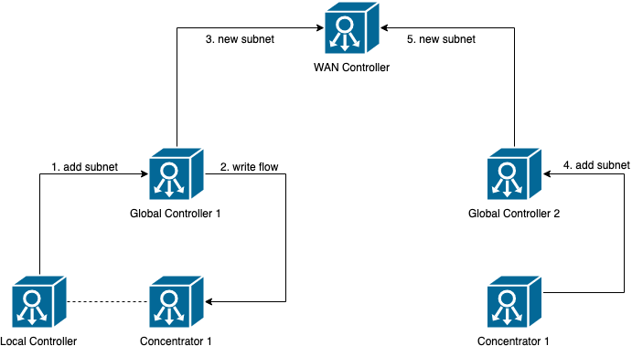
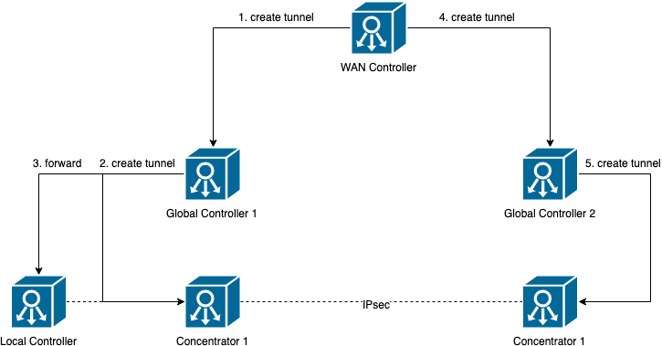

# Architecture

## Goals

- Low latency between data and control plane
- Reliability -> Each site should be able to work independent of each other
- Division of responsibility
- Central control

## General Overview

The prototype is implemented using P4 to program the data plane
and Python to program the control plane.

It has a 3-tier architecture consisting of a local, global and WAN controller.
For each instance of the prototype only one WAN controller exists, which manages
the connections between each site and every roadwarrior client.
Every site has a global controller which is registered at the WAN controller
and manages all the connections between the switches.
In order to do that, the control messages of the global controller are relayed
to each local controller, which then writes the according table entries
to the switch.
The local controllers only known the local connections of the switch.
Its task is to send out messages (e.g. LLDP packets), write table entries
and notify the global controller if a topology change etc. happens at the switch.
This reduces the load on the global controller and decreases the latency
if a packet is forwarded to the controller, if the local controller is installed
on the hardware of the switch.

To sum it up the WAN controller manages multiple global controller which in turn
manage multiple local controller.

## Controller

Every program is based on a `Controller` (`common_lib.controller.controller`).
A controller has a `Repl`, a `Logger` and an `EventSystem`.
The `Repl` is used to process commands from the user whilst the logger prints messages
in the terminal, saves them in files or forwards them to other controllers
(e.g. if a command is send from the WAN controller to the global controller).

The main task of the controller is to start the interface and run managers which
in turn execute specific tasks like managing IPsec rules.
Therefore the EventSystem is used which works like an event loop.
Every time an event occures a reentrant lock is set and the event is executed.
This makes it easier to deal with multiple threads without having to set a lock every time.
By default every application will have multiple threads like a thread for communication
with the P4runtime, a thread on which the main interface is executed etc.
The EventSystem also provides a `set_timeout` and `set_interval` method with which
the user can schedule when a function is executed, or use to periodically send packets
like LLDP packets.

Every controller has a `prepare` and a `shutdown` hook.
The `prepare` hook is executed when the controller is started and the `shutdown` hook
is executed when the controller is shutdown.
Thus the `prepare` hook should be used to start services / managers of the controller
and the `shutdown` hook should be used to stop services and perform cleanup tasks.

E.g. the local controller may start an LLDP manager which registeres a periodic `send_lldp_packets` command.
In the `shutdown` method the controller notifies the global controller
that its connections are deleted.
Thus the topology of the global controller can be updated when the local controller is
correctly shutdown.
Otherwise the connected switches detect that a link is broken and send the update
to the global controller.

### Local controller

The local controller has a `switch_connection`, a `port_monitor`, a `packet_processor`,
an `interface` and managers.
The switch connection is used to send commands to the P4Runtime thus write
or delete table entries in the P4 program.
The `packet_processor` receives packets which are send from the switch to the controller
and delegates them to the according manager.
In order to get notified if a port of the switch goes down the `port_monitor` provides
an mechanism to listen for such events.
Messages from the global controller can be received by the `interface`, which
also delegates tasks to the managers.
Each manager has a specific task, e.g. the `macsec_manager` manages
the macsec rules. If a new rule is received from the global controller
the `macsec_manager` checks if it does not exist and writes it to the switch.
The other managers work similarly.


### Global controller

### WAN controller

## Site-to-Site

To connect two sites with each other you must run:
```
connect <site1-ip> <site2-ip>
```

This will connect the sites 1 and 2 with each other.
It is accomplished by the following mechanism.

### Propagate subnets to WAN controller and install Routing rules

In order to forward traffic between two sites each site must know the subnets of the other
site. Therefore the administrator writes in the config of each local controller
which subnets it has.
Every time a local controller registers a new subnet or deletes
one these changes are propegated to the global controller.
The global controller then recalculates the routes within its domain
and forces the local controllers to delete and create routing rules on the switch.
Furthermore it propagates the subnet change to the WAN controller.
The WAN controller maintains a list of subnets for each global controller.

E.g. figure 1 depicts that the local controller propagates its subnet to 
global controller 1 which in turn writes a forwarding rule to the concentrator.
Thus the concentrator will forward all traffic for the subnet to the local controller.
Then the subnet is propagated to the WAN controller which adds the subnet to the
subnets of global controller 1.
Analogously this is repeated for the second site.



Figure 1 - Register Subnets

### Connect sites by creating IPsec tunnel
If a tunnel is created between two sites the WAN controller sends a tunnel configuration
to each global controller which will then send it to the concentrator.
A tunnel configuration consists of the concentrator IPs, their subnets and two connections.
Each connection consists of an SPI, the encryption and authorization key,
a soft time limit as well as a soft packet limit.
The concentrator is a local controller that writes the IPsec rules for each subnet.



### TODO

- Send tunnel expiration to the WAN controller for rekeying.

## Roadwarrior client

TODO

In general the roadwarrior client works similar to the local controller.
It must install IPsec tunnels and MACsec rules. However the roadwarrior client
should not maintain a connection to the WAN controller in order to decrease the load on
the WAN controller and prevent problems with a NAT.

Actually in my opinion this still has to be evaluated.
GRPC streams can be used to maintain a connection without having trouble with the NAT.
However the WAN controller would still have to maintain thousands of connections.
The dilemma arises if a subnet changes. Then the WAN controller cannot send 
a push notification to the client to update the tunnel. If the client however polls
for updates this would probably increase the load on the WAN controller.

It might also be nice to have a push notification for the MACsec client.

It is also a question weather the client should (solution 1) communicate
with the WAN controller or (solution 2) the global controller
to refresh the tunnels.

Solution 1:

| Advantages                                       | Disadvantages                   |
|--------------------------------------------------|---------------------------------|
| easy to implement.                               | increase load on WAN controller |
| no exposure of global controller to the outside. |                                 |

Solution 2:

| Advantages                  | Disadvantages                                 |
|-----------------------------|-----------------------------------------------|
| harder to implement         | exposure of global controller to the internet |
| less load on WAN controller |                                               |


